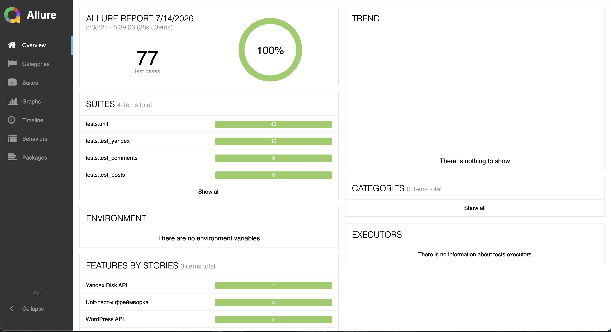
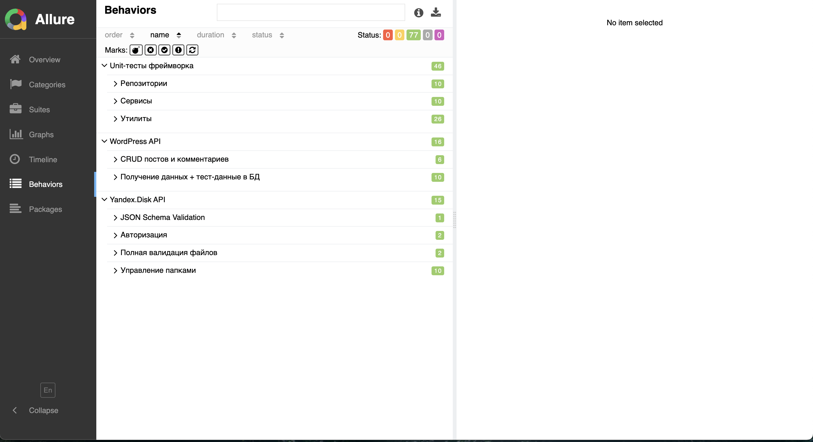
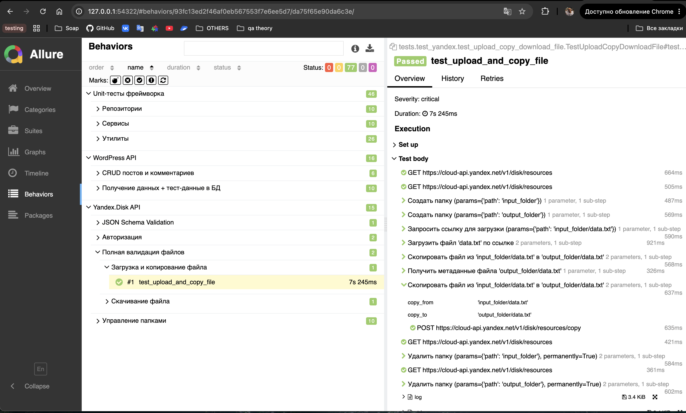
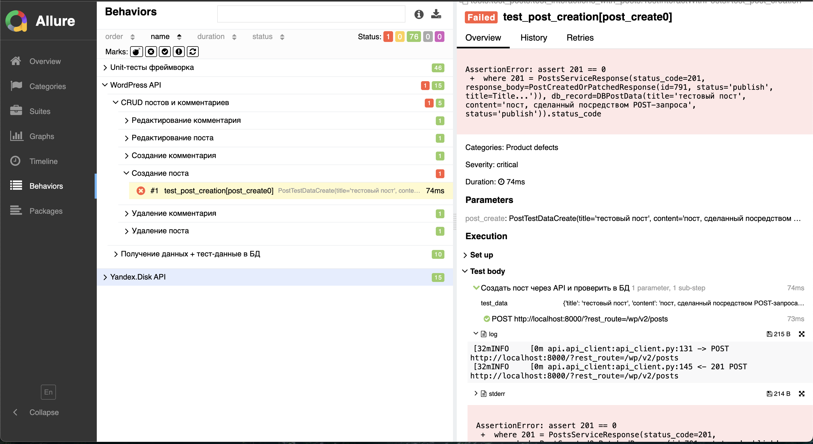

# API Test Automation Framework


API-автотесты на Python + pytest для WordPress REST API и API Яндекс.Диска. Ключевая особенность - проверка не только ответа API, но и **реального состояния базы данных**: после операции через API тест сверяет результат с записью в MySQL. Построен по слоистой архитектуре (HTTP-клиент -> service -> repository -> DAO -> БД) с типизированными моделями и валидацией ответов по JSON Schema.

Проект выполнен в рамках внешней стажировки SimbirSoft под руководством ментора. Список автоматизированных задач (блок API: API1-API7) с привязкой к коду - в [docs/task-coverage.md](docs/task-coverage.md).

## Оглавление

- [Ключевые особенности](#ключевые-особенности)
- [Технологии](#технологии)
- [Структура проекта](#структура-проекта)
- [Настройка окружения](#настройка-окружения)
- [Запуск тестов](#запуск-тестов)
- [Allure-отчёт](#allure-отчёт)
- [Архитектурные решения](#архитектурные-решения)

## Ключевые особенности

- **Сверка API с базой данных**: результат каждой операции (создание/изменение/удаление) проверяется в MySQL, а не только по телу ответа - тест ловит расхождения между API и реальным состоянием данных
- **Слоистая архитектура**: HTTP-клиент -> service-слой -> repository -> DAO -> БД, каждый слой со своей зоной ответственности
- **Типизированный HTTP-клиент**: дженерик-обёртка `FullAPIResponse[M, E]`, десериализация ответов и ошибок в pydantic-модели, для каждого API - своя модель ошибки
- **Юнит-тесты фреймворка**: репозитории, сервисы и утилиты покрыты тестами на подставных зависимостях (fake/stub/spy) - логика проверяется без реальной БД и сети
- **Allure-отчёт**: Epic/Feature/Story/Severity на всех тестах, шаги на HTTP-запросы и сценарии сервисов
- **Логирование**: весь HTTP и SQL-трафик пишется в лог (без секретов - токены и пароли не логируются)
- **Валидация структуры ответов** по JSON Schema (список файлов Яндекс.Диска)
- **Фабрики тест-данных**: генерация постов и комментариев через factory_boy + Faker
- **Два реальных API**: WordPress REST (посты, комментарии) и Яндекс.Диск (папки, файлы, корзина)
- **Параллельный прогон** через pytest-xdist

## Технологии

| Компонент                    | Версия        | Назначение                              |
|-------------------------------|---------------|------------------------------------------|
| Python                        | 3.10          | Базовый язык проекта                     |
| pytest                        | 9.0+          | Фреймворк тестирования                   |
| pytest-xdist                  | 3.8+          | Параллельный запуск                      |
| requests                      | 2.34+         | HTTP-клиент                              |
| pydantic / pydantic-settings  | 2.13+ / 2.14+ | Модели ответов, типизированный конфиг    |
| mysql-connector-python        | 9.7+          | Доступ к БД для сверки                    |
| jsonschema                    | 4.26+         | Валидация структуры ответов              |
| factory_boy / Faker           | 3.3+ / 40.19+ | Фабрики тест-данных                      |
| allure-pytest                 | 2.16+         | Отчёты Allure (Epic/Feature/Story, шаги)  |

## Структура проекта

```
ss_sdet_api/
├── api/                       # HTTP-клиент и эндпоинты
│   ├── api_client.py          # APIClient: запросы, десериализация в модели
│   └── endpoints.py
├── services/                  # Бизнес-логика поверх API
│   ├── base_service.py
│   ├── posts_service.py       # сверка с БД через репозиторий
│   ├── comments_service.py
│   └── yandex_service.py
├── database/                  # Слой данных
│   ├── database_session.py    # Соединение с MySQL
│   ├── dao/                   # SQL-запросы (сырьё)
│   ├── repositories/          # Маппинг сырья в доменные модели
│   └── queries/               # SQL-константы
├── models/                    # pydantic-модели (posts / comments / yandex)
├── schemas/                   # JSON Schema для валидации
├── data_for_tests/            # Фабрики и наборы тест-данных
├── utils/                     # Генераторы, файловые операции, хелперы
├── config/                    # Настройки и креды
├── docs/                      # ARCHITECTURE.md, task-coverage.md
├── tests/                     # Тесты и фикстуры
│   ├── test_posts/
│   ├── test_comments/
│   ├── test_yandex/
│   └── unit/                  # Юнит-тесты фреймворка (без БД и сети)
├── bash_scripts/              # Скрипты запуска
└── docker-compose.yml         # WordPress + MySQL (тестируемое приложение)
```

## Настройка окружения

### 1. Тестируемое приложение - WordPress

Проект тестирует локальный WordPress. `docker-compose.yml` в корне репозитория поднимает MySQL + WordPress:

1. Установить Docker и Docker Compose.
2. В корне проекта выполнить `docker-compose up` - поднимутся два контейнера: MySQL (порт `3306`) и WordPress (порт `8000`).
3. Открыть `http://localhost:8000/`, пройти начальную настройку WordPress (язык, название сайта, логин/пароль администратора).
4. Установить и активировать плагин Basic-Auth (для авторизованных запросов к REST API).

REST API будет доступен по `http://localhost:8000/index.php?rest_route=/`.

### 2. Python-окружение

```bash
python -m venv venv
source venv/bin/activate        # Windows: venv\Scripts\activate
pip install -r requirements.txt
```

### 3. Переменные окружения

Создать `.env` - значения БД фиксированы docker-compose, логин/пароль WordPress те, что задал при установке:
```dotenv
API_HOST=localhost
API_PORT=8000
API_USER=<WordPress-логин>
API_PSWD=<WordPress-пароль>

DB_HOST=localhost
DB_PORT=3306
DB_USER=wordpress
DB_PASSWORD=wordpress
DB_NAME=wordpress
```

Создать `.env.yandex` (Яндекс.Диск):
```dotenv
YA_HOST=https://cloud-api.yandex.net
YA_OAUTH_TOKEN=<OAuth-токен получить в Яндекс Полигоне>
```

## Запуск тестов

```bash
pytest                       # все тесты
pytest tests/test_posts      # только посты
pytest tests/test_yandex     # только Яндекс.Диск
pytest tests/unit            # только юниты, без БД и сети
pytest -n 3 tests/           # параллельно (pytest-xdist)
```

Пример вывода (`pytest -n 3 tests/`):
```
============================================ test session starts ============================================
platform darwin -- Python 3.10.19, pytest-9.0.3, pluggy-1.6.0
rootdir: /Users/chajan/dev/ss_sdet_api
configfile: pyproject.toml
plugins: allure-pytest-2.16.0, xdist-3.8.0, Faker-40.19.1
3 workers [77 items]
.............................................................................                         [100%]
============================================ 77 passed in 17.66s ============================================
```

## Allure-отчёт

Каждый тест размечен Epic/Feature/Story/Severity, а HTTP-запросы и ключевые сценарии сервисов обёрнуты в шаги - в отчёте видно не просто "тест прошёл", а какой конкретно запрос ушёл и что вернулось.

```bash
pytest --alluredir=allure-results
allure serve allure-results
```

Обзор прогона - все 77 тестов:



Три Epic: два внешних API и юнит-тесты самого фреймворка, разбитые по Feature:



Вложенные шаги: сценарий сервиса, а внутри - конкретные HTTP-запросы:



Упавший тест: виден шаг с ошибкой, diff ассерта и приложенный лог запроса:



## Архитектурные решения

Подробное описание слоёв и принятых решений в [docs/ARCHITECTURE.md](docs/ARCHITECTURE.md).

Кратко: API-клиент отвечает только за транспорт и десериализацию, service-слой - за сценарии и сверку с БД, repository переводит сырые строки БД в доменные модели, DAO инкапсулирует SQL. Такое разделение изолирует изменения (смена схемы БД правит только DAO) и делает логику тестируемой без реальной БД (через подмену репозитория).
